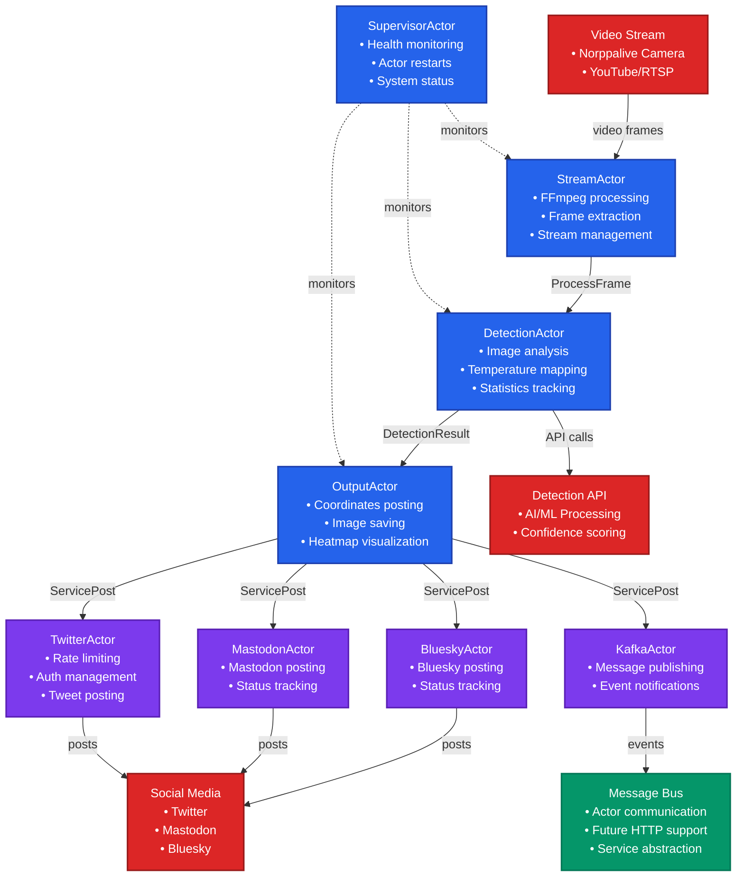

# Norppalive Service

Norppalive Service is an application designed to detect Saimaa ringed seals from the Finnish WWF livestream [Norppalive](https://wwf.fi/luontolive/norppalive/). This service uses an actor-based architecture for fault-tolerant, scalable real-time detection and social media posting.

## Table of Contents

- [Architecture Overview](#architecture-overview)
- [Prerequisites](#prerequisites)
- [Installation](#installation)
- [Configuration](#configuration)
- [Usage](#usage)
- [File Structure](#file-structure)
- [Running Tests](#running-tests)
- [Development](#development)
- [License](#license)
- [Contact](#contact)

## Architecture Overview

The service uses an **Actix actor-based architecture** for robust, fault-tolerant processing:



### Key Features

- **Fault Tolerance**: Individual service failures don't crash the system
- **Rate Limiting**: Built-in social media rate limiting with automatic recovery
- **Health Monitoring**: Comprehensive actor health tracking and automatic restarts
- **Scalability**: Easy to add new social media services as actors
- **Clean Separation**: Each component has clear responsibilities
- **Future-Ready**: Message bus abstraction allows external service integration

## Prerequisites

- [Rust](https://www.rust-lang.org/tools/install) (1.70+)
- [Python](https://www.python.org/downloads/) (for yt-dlp)
- [yt-dlp](https://github.com/yt-dlp/yt-dlp) (to get the stream URL from YouTube livestream)
- [ffmpeg](https://ffmpeg.org) (for video processing)

## Installation

1. Clone the repository:
    ```sh
    git clone https://github.com/dilaz/norppalive_service.git
    ```
2. Navigate to the project directory:
    ```sh
    cd norppalive_service
    ```
3. Install Rust dependencies:
    ```sh
    cargo build
    ```
4. Make sure yt-dlp is installed:
    ```sh
    pip install -U yt-dlp
    ```
5. Copy config template to `config.toml` and fill in the missing info:
    ```sh
    cp config.toml.example config.toml
    ```

## Configuration

Fill in the `config.toml` file with the necessary information. The configuration includes:

- **Stream settings**: Video source URL and processing options
- **Detection settings**: AI API configuration, confidence thresholds, heatmap parameters
- **Output settings**: Social media posting intervals, image saving, visualization options
- **Service credentials**: Twitter, Mastodon, Bluesky, and Kafka configuration

Refer to the comments in the `config.toml.example` for detailed guidance.

## Usage

### Basic Usage

To start the detection service with actor-based processing:
```sh
cargo run
```

The service will:
1. Initialize the actor system with health monitoring
2. Start video stream processing
3. Perform real-time seal detection using AI/ML
4. Post to configured social media services when detections meet criteria
5. Save detection images and heatmap visualizations
6. Send notifications via Kafka for external integrations

### Environment Variables

- `CONFIG_PATH`: Path to configuration file (default: `config.toml`)
- `RUST_LOG`: Logging level (e.g., `norppalive_service=debug`)

## File Structure

```
src/
├── main.rs                     # Application entry point and actor system initialization
├── config.rs                   # Configuration management with shared CONFIG
├── error.rs                    # Error types and handling
├── lib.rs                      # Library exports for external binaries
├── actors/                     # Actor implementations
│   ├── mod.rs                  # Actor module exports
│   ├── supervisor.rs           # SupervisorActor - health monitoring & restarts
│   ├── stream.rs               # StreamActor - video processing & frame extraction
│   ├── detection.rs            # DetectionActor - AI detection & analysis
│   ├── output.rs               # OutputActor - coordinates posting & saving
│   └── services/               # Service-specific actors
│       ├── mod.rs              # Service actor exports
│       ├── twitter.rs          # TwitterActor - Twitter posting with rate limiting
│       ├── mastodon.rs         # MastodonActor - Mastodon integration
│       ├── bluesky.rs          # BlueskyActor - Bluesky social posting
│       └── kafka.rs            # KafkaActor - event messaging
├── messages/                   # Actor message definitions
│   ├── mod.rs                  # Message exports
│   ├── stream.rs               # Stream processing messages
│   ├── detection.rs            # Detection and analysis messages
│   ├── output.rs               # Output coordination messages
│   └── system.rs               # System management messages
├── message_bus/                # Communication abstraction layer
│   ├── mod.rs                  # Message bus exports
│   ├── trait_def.rs            # MessageBus trait definition
│   ├── actor_bus.rs            # Internal actor communication
│   └── http_bus.rs             # Future external service support
├── services/                   # Legacy service implementations
│   ├── mod.rs                  # Service exports and traits
│   ├── generic.rs              # SocialMediaService trait
│   ├── twitter.rs              # Original Twitter service
│   ├── mastodon.rs             # Original Mastodon service
│   ├── bluesky.rs              # Original Bluesky service
│   └── kafka.rs                # Original Kafka service
└── utils/                      # Utility functions and helpers
    ├── detection_utils.rs       # Detection processing and API integration
    ├── output.rs                # Output coordination utilities
    ├── image_utils.rs           # Image processing and visualization
    └── temperature_map.rs       # Heatmap generation and analysis
```

## Running Tests

The project includes comprehensive unit, integration, and actor tests covering all components of the system.

### Test Coverage

#### Core Actor Tests (61 tests total)
- **SupervisorActor** (8 tests): Health monitoring, actor registration, restart functionality, system health reporting
- **DetectionActor** (6 tests): Frame processing, statistics tracking, error handling, concurrent operations
- **OutputActor** (8 tests): Social media posting, image saving, heatmap visualization, service coordination
- **StreamActor** (10 tests): Stream start/stop, frame extraction, concurrent operations, various stream URLs
- **TwitterActor** (12 tests): Rate limiting, service status, error handling, concurrent requests, authentication

#### Integration Tests (8 tests)
- **Actor Communication**: Inter-actor message passing and coordination
- **Full System Startup**: Complete actor system initialization and health checks
- **Error Handling**: Graceful error handling across the actor system
- **Concurrent Operations**: Multiple actors handling requests simultaneously
- **Message Bus Abstraction**: Future-ready communication patterns

#### Utility Tests (9 tests)
- **Detection Utils**: Temperature mapping, hotspot detection, configuration handling
- **Temperature Map**: Heatmap generation, hotspot analysis, decay algorithms
- **Kafka Services**: Event serialization and notification handling

#### Legacy Tests (2 tests)
- **Main Module**: Stream URL processing and frame saving functionality

### Running Tests

To run the complete test suite:
```sh
cargo test
```

To run tests with output:
```sh
cargo test -- --nocapture
```

To run specific test modules:
```sh
# Run only actor tests
cargo test actors

# Run only integration tests
cargo test integration_tests

# Run only utility tests
cargo test utils

# Run only service tests
cargo test services
```

To run tests for specific actors:
```sh
# Test supervisor functionality
cargo test supervisor

# Test detection processing
cargo test detection

# Test output coordination
cargo test output

# Test stream processing
cargo test stream

# Test Twitter service
cargo test twitter
```

### Test Architecture

The test suite follows Actix best practices:

- **Unit Tests**: Each actor is tested in isolation using `#[actix::test]`
- **Integration Tests**: Multi-actor scenarios testing message flow and coordination
- **Mock Data**: Tests use generated images and detection results to avoid external dependencies
- **Error Simulation**: Tests verify graceful handling of various error conditions
- **Concurrent Testing**: Tests verify thread-safety and concurrent message handling

### Continuous Integration

Tests are designed to work in CI environments:
- No external service dependencies required
- Mock data and temporary files used where needed
- Graceful handling of missing configuration files
- Environment variable detection for CI-specific behavior

### Performance Testing

For performance benchmarks:
```sh
cargo bench
```

Note: Benchmarks require the `bench` feature and nightly Rust compiler.

## Development

### Adding New Social Media Services

1. Create a new actor in `src/actors/services/your_service.rs`
2. Implement the required message handlers (`ServicePost`, `GetServiceStatus`)
3. Add the service to the service actor exports in `src/actors/services/mod.rs`
4. Update the configuration to include your service credentials
5. Add the service to the `Service` enum in `src/config.rs`

### Message Flow

The system uses a message-passing architecture:

1. **StreamActor** extracts frames and sends `ProcessFrame` messages
2. **DetectionActor** processes images and sends `DetectionCompleted` messages
3. **OutputActor** coordinates posting via `PostToSocialMedia` messages
4. **Service Actors** handle platform-specific posting logic
5. **SupervisorActor** monitors health and manages restarts

### Future Enhancements

The message bus abstraction allows for:
- **External HTTP API**: REST endpoints for triggering posts from separate binaries
- **Microservice Architecture**: Distributed actor deployment
- **Event Sourcing**: Complete audit trail of detection events
- **Real-time Dashboards**: WebSocket connections for live monitoring

## License

This project is licensed under the MIT License. See the [LICENSE](LICENSE) file for details.

## Contact

For questions, feedback, or contributions:
- Open an issue on the [GitHub repository](https://github.com/dilaz/norppalive_service)
- Contact the maintainers through GitHub

---

*This service is part of conservation efforts to monitor and protect the endangered Saimaa ringed seal population in Finland.*
